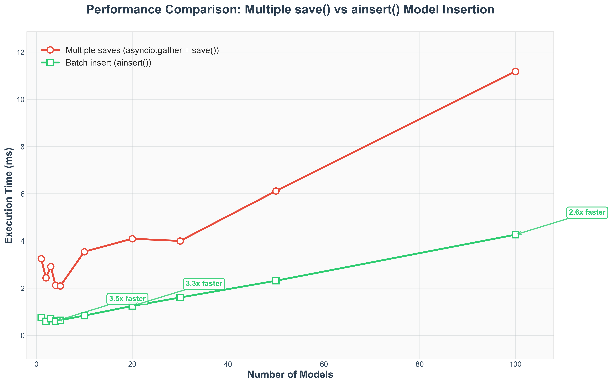
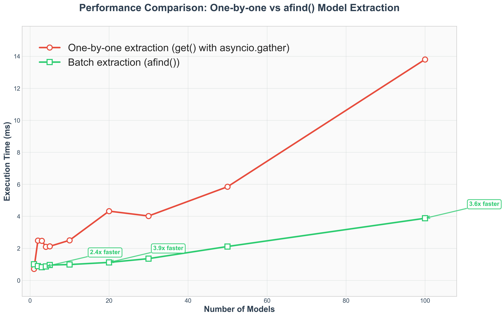
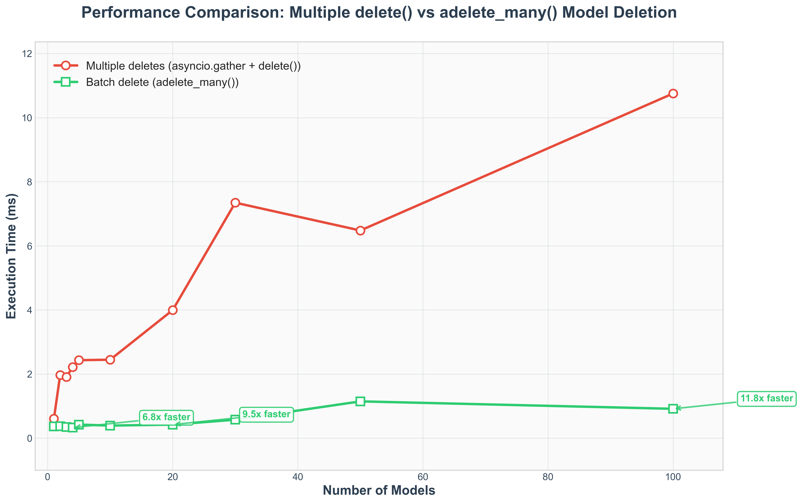

# CRUD Operations

After defining your model, you'll need to perform basic CRUD (Create, Read, Update, Delete) operations with Redis. This page covers how to save, retrieve, and delete model instances.

## Saving Models

### Single Model Save

Use the `save()` method to store your model instance in Redis:

```python
import asyncio
from rapyer import AtomicRedisModel
from typing import List, Dict


class User(AtomicRedisModel):
    name: str
    age: int
    email: str
    tags: List[str] = []
    preferences: Dict[str, str] = {}


async def main():
    # Create a user instance
    user = User(
        name="Alice",
        age=25,
        email="alice@example.com",
        tags=["python", "developer"],
        preferences={"theme": "dark", "language": "en"}
    )

    # Save to Redis
    await user.asave()
    print(f"Saved user with key: {user.key}")


if __name__ == "__main__":
    asyncio.run(main())
```

### Bulk Model Insert - `ainsert()`

For better performance when saving multiple models, use the `ainsert()` classmethod which performs all insertions in a single Redis transaction:

```python
async def bulk_save_example():
    # Create multiple user instances
    users = [
        User(name="Alice", age=25, email="alice@example.com", tags=["python"]),
        User(name="Bob", age=30, email="bob@example.com", tags=["redis"]),
        User(name="Charlie", age=35, email="charlie@example.com", tags=["async"]),
        User(name="Diana", age=28, email="diana@example.com", tags=["database"])
    ]
    
    # Bulk insert all users in a single transaction
    await User.ainsert(*users)
    print(f"Successfully saved {len(users)} users in one transaction")
    
    # Verify all users were saved
    saved_users = await User.afind()
    print(f"Found {len(saved_users)} users in Redis")

if __name__ == "__main__":
    asyncio.run(bulk_save_example())
```

**Why `ainsert()` is Better Than Individual `save()` Calls:**

- **Transactional**: All models are saved atomically - either all succeed or all fail
- **Performance**: Single Redis pipeline operation instead of multiple round trips
- **Network Efficiency**: Reduces network latency by batching operations

### Performance Comparison: `ainsert()` vs Multiple `save()` Operations

The `ainsert()` method provides significant performance improvements over multiple individual save operations, even when using `asyncio.gather()` for concurrency. The chart below shows the performance difference:



## Retrieving Models

Use the `get()` class method to load model instances from Redis:

```python
async def main():
    # Create and save a user
    user = User(name="Bob", age=30, email="bob@example.com")
    await user.asave()
    user_key = user.key

    # Retrieve the user by key
    loaded_user = await User.aget(user_key)
    print(f"Loaded user: {loaded_user.name}, Age: {loaded_user.age}")

    # Handle non-existent keys
    missing_user = await User.aget("non-existent-key")
    if missing_user is None:
        print("User not found")


if __name__ == "__main__":
    asyncio.run(main())
```

### Using rapyer.get() - Global Retrieval

You can also retrieve models using the global `rapyer.get()` function, which can load any model type by examining the Redis key:

```python
import rapyer


async def main():
    # Create and save a user
    user = User(name="Bob", age=30, email="bob@example.com")
    await user.asave()
    user_key = user.key

    # Retrieve using the global get function
    loaded_model = await rapyer.get(user_key)
    print(f"Loaded model: {loaded_model.name}, Age: {loaded_model.age}")
    print(f"Model type: {type(loaded_model).__name__}")

    # Works with any model type - rapyer.get automatically determines the correct class
    # from the Redis key pattern (ClassName:instance_id)


if __name__ == "__main__":
    asyncio.run(main())
```

The `rapyer.get()` function automatically determines the correct model class from the Redis key format and returns the appropriate model instance. This is particularly useful when you have multiple model types and want a unified way to retrieve them.

## Finding All Model Instances

Use the `afind()` class method to retrieve all instances of a specific model class from Redis:

```python
async def main():
    # Create and save multiple users
    users = [
        User(name="Alice", age=25, email="alice@example.com"),
        User(name="Bob", age=30, email="bob@example.com"),
        User(name="Charlie", age=35, email="charlie@example.com")
    ]

    for user in users:
        await user.asave()

    # Find all User instances
    all_users = await User.afind()
    print(f"Found {len(all_users)} users:")

    for user in all_users:
        print(f"- {user.name} ({user.age}) - {user.email}")


if __name__ == "__main__":
    asyncio.run(main())
```

This is much more efficient than individual get operations when you need to retrieve multiple instances.

### Performance Comparison: `afind()` vs Individual `get()` Operations

The `afind()` method provides significant performance improvements over retrieving models individually, especially as the number of models increases. The chart below shows the performance difference:



**Key Performance Benefits:**

- **Batch Operations**: `afind()` uses Redis's `MGET` command to retrieve multiple models in a single operation
- **Reduced Network Overhead**: One network round-trip instead of multiple individual requests
- **Exponential Performance Gains**: Performance improvement scales dramatically with model count
  - **3+ models**: ~1.5-3x faster
  - **20+ models**: ~6-8x faster  
  - **100+ models**: ~10x faster

**When to Use Each Method:**

```python
async def performance_example():
    # ❌ Inefficient for multiple models
    user_keys = await User.afind_keys()
    users = []
    for key in user_keys:  # Multiple network round-trips
        user = await User.aget(key)
        users.append(user)

    # ✅ Efficient batch retrieval
    users = await User.afind()  # Single network round-trip

    print(f"Retrieved {len(users)} users efficiently")
```

### Finding vs. Loading Individual Models

- Use `afind()` when you need all instances of a model class
- Use `get()` when you know the specific key you want to retrieve
- Use `afind_keys()` if you only need the Redis keys without loading the full models

```python
async def main():
    # Get just the keys
    user_keys = await User.afind_keys()
    print(f"User keys: {user_keys}")

    # Get all user instances
    users = await User.afind()
    print(f"Loaded {len(users)} users")

    # Get specific user by key
    specific_user = await User.aget(user_keys[0])
    print(f"Specific user: {specific_user.name}")


if __name__ == "__main__":
    asyncio.run(main())
```

## Updating Models

There are several ways to update model data:

### Full Model Update

Modify the model instance and save again:

```python
async def main():
    # Create and save user
    user = User(name="Charlie", age=28, email="charlie@example.com")
    await user.asave()

    # Update and save
    user.age = 29
    user.email = "charlie.new@example.com"
    await user.asave()

    # Verify the update
    updated_user = await User.aget(user.key)
    print(f"Updated age: {updated_user.age}, email: {updated_user.email}")


if __name__ == "__main__":
    asyncio.run(main())
```

### Field-Level Atomic Updates

For better performance and atomicity, update specific fields:

```python
async def main():
    user = User(name="David", age=35, tags=["manager"], preferences={"theme": "dark"})
    await user.asave()

    # Atomic field updates
    user.age = 36
    await user.age.asave()  # Save only the age field

    # Atomic collection operations
    await user.tags.aappend("leader")
    await user.preferences.aupdate(language="fr")

    # Verify updates
    updated_user = await User.aget(user.key)
    print(f"Updated user: {updated_user.name}, Age: {updated_user.age}")
    print(f"Tags: {updated_user.tags}, Preferences: {updated_user.preferences}")


if __name__ == "__main__":
    asyncio.run(main())
```

## Deleting Models

### Single Model Deletion

Remove model instances from Redis using the `delete()` method:

```python
async def main():
    # Create and save user
    user = User(name="Eve", age=22, email="eve@example.com")
    await user.asave()
    user_key = user.key

    # Delete from Redis
    await user.adelete()
    print(f"Deleted user with key: {user_key}")

    # Verify deletion
    deleted_user = await User.aget(user_key)
    if deleted_user is None:
        print("User successfully deleted")


if __name__ == "__main__":
    asyncio.run(main())
```

### Bulk Model Deletion - `adelete_many()`

For better performance when deleting multiple models, use the `adelete_many()` classmethod which performs all deletions in a single Redis transaction:

```python
async def bulk_delete_example():
    # Create and save multiple users
    users = [
        User(name="Alice", age=25, email="alice@example.com"),
        User(name="Bob", age=30, email="bob@example.com"),
        User(name="Charlie", age=35, email="charlie@example.com"),
        User(name="Diana", age=28, email="diana@example.com")
    ]
    
    # Save all users
    await User.ainsert(*users)
    print(f"Created {len(users)} users")
    
    # Bulk delete all users in a single transaction
    await User.adelete_many(*users)
    print(f"Successfully deleted {len(users)} users in one transaction")
    
    # Verify all users were deleted
    remaining_users = await User.afind()
    print(f"Remaining users in Redis: {len(remaining_users)}")

if __name__ == "__main__":
    asyncio.run(bulk_delete_example())
```

**Why `adelete_many()` is Better Than Individual `delete()` Calls:**

- **Transactional**: All models are deleted atomically - either all succeed or all fail
- **Performance**: Single Redis operation instead of multiple round trips
- **Network Efficiency**: Reduces network latency by batching operations

### Performance Comparison: `adelete_many()` vs Individual `delete()` Operations

The `adelete_many()` method provides significant performance improvements over deleting models individually, even when using `asyncio.gather()` for concurrency. The chart below shows the performance difference:



## Finding All Model Keys

Discover all Redis keys for a specific model class:

```python
async def main():
    # Create multiple users
    user1 = User(name="Alice", age=25, email="alice@example.com")
    user2 = User(name="Bob", age=30, email="bob@example.com")
    user3 = User(name="Charlie", age=35, email="charlie@example.com")

    await user1.asave()
    await user2.asave()
    await user3.asave()

    # Find all User keys in Redis
    user_keys = await User.afind_keys()
    print(f"Found {len(user_keys)} users: {user_keys}")

    # Load all users manually (less efficient approach)
    users = []
    for key in user_keys:
        user = await User.aget(key)
        users.append(user)

    for user in users:
        print(f"User: {user.name}, Age: {user.age}")

    # More efficient approach using afind()
    all_users = await User.afind()
    print(f"Loaded all users efficiently: {len(all_users)}")


if __name__ == "__main__":
    asyncio.run(main())
```

## Complete CRUD Example

Here's a comprehensive example showing all CRUD operations:

```python
import asyncio
import redis.asyncio as redis
from rapyer import AtomicRedisModel
from typing import List, Dict


class User(AtomicRedisModel):
    name: str
    age: int
    email: str
    tags: List[str] = []
    preferences: Dict[str, str] = {}


async def crud_example():
    # Setup Redis connection
    redis_client = redis.Redis(
        host='localhost',
        port=6379,
        db=0,
        decode_responses=True
    )
    User.Meta.redis = redis_client
    User.Meta.ttl = 3600  # 1 hour TTL

    # CREATE
    user = User(
        name="John Doe",
        age=30,
        email="john@example.com",
        tags=["developer", "python"],
        preferences={"theme": "dark", "notifications": "enabled"}
    )
    await user.asave()
    print(f"Created user: {user.key}")

    # READ
    loaded_user = await User.aget(user.key)
    print(f"Retrieved: {loaded_user.name}, {loaded_user.age}")

    # UPDATE
    loaded_user.age = 31
    await loaded_user.tags.aappend("redis")
    await loaded_user.preferences.aupdate(theme="light")
    await loaded_user.asave()
    print("Updated user")

    # Verify update
    updated_user = await User.aget(user.key)
    print(f"After update: Age={updated_user.age}, Tags={updated_user.tags}")

    # DELETE
    await updated_user.adelete()
    print("Deleted user")

    # Verify deletion
    deleted_user = await User.aget(user.key)
    print(f"After deletion: {deleted_user}")  # Should be None


if __name__ == "__main__":
    asyncio.run(crud_example())
```

This covers all the essential CRUD operations you'll need when working with Rapyer models in Redis.